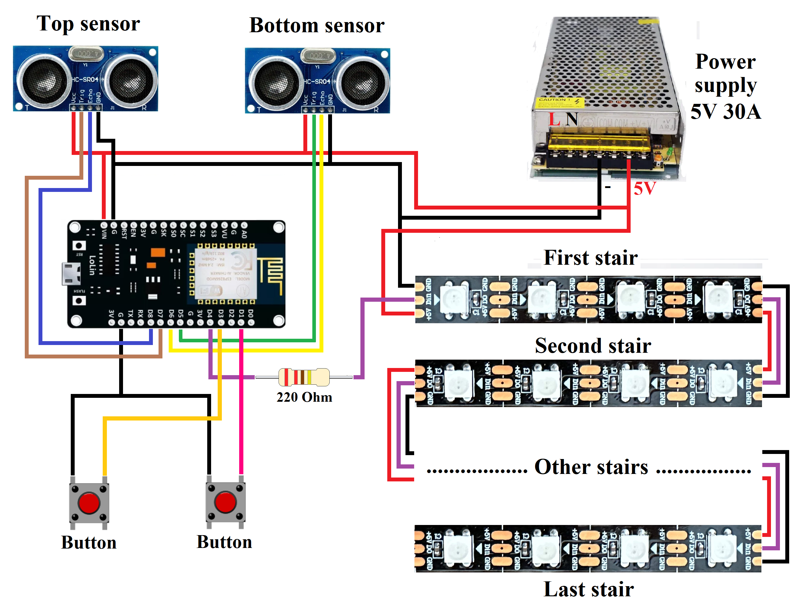

# SmartStairLights

**SmartStairLights** — это проект умной подсветки лестницы с использованием адресной светодиодной ленты WS2812B, управляемой ультразвуковыми датчиками. Система разработана на базе Arduino и написан на языке C++ с использованием **Arduino IDE**. 

## О проекте

Цель проекта — создать "умную" подсветку для лестницы, которая автоматически включается, когда человек начинает подниматься или спускаться. Система использует два ультразвуковых датчика (расположенные вверху и внизу лестницы), которые обнаруживают движение и активируют светодиодную ленту.

Основные возможности проекта:
- Первый режим: подсветка автоматически и анимационно включается, начиная с первой ступени, в направлении движения с помощью ультразвуковых датчиков. Система определяет, в какую сторону движется человек (вверх или вниз по лестнице), и включает подсветку в соответствующем направлении. Подсветка плавно и анимационно загорается и гаснет, создавая эффект динамичного освещения каждой ступени.

  ```c
  #define FADE_IN_STEPS_ON 6       // количество шагов для плавного включения светодиодов 
  #define FADE_OUT_STEPS_OFF 6     // количество шагов для плавного выключения светодиодов 
  #define FADE_DELAY_ON 2          // задержка между шагами для включения (в миллисекундах)    
  #define FADE_DELAY_OFF 2         // задержка между шагами для выключения (в миллисекундах) 
  ```
  Изменяя эти значения, вы можете регулировать скорость анимации включения и выключения. Также подсветка автоматически отключается через определённое время, если не   зафиксировано движение.
  ```c
  unsigned long delayBeforeTurnOff = 0;             // время, которое светодиоды будут гореть перед выключением
  unsigned long holdTime = 0;                       // время, на которое свет остаётся включенным после срабатывания датчика
  const unsigned long delayBeforeTurnOff_0 = 7000;  // время свечения для первого режима (в миллисекундах)
  const unsigned long holdTime_0 = 7000;            // время удержания для первого режима (в миллисекундах)
  const unsigned long delayBeforeTurnOff_1 = 10000; // время свечения для второго режима (в миллисекундах)
  const unsigned long holdTime_1 = 4000;            // время удержания для второго режима (в миллисекундах)
  ```
- Второй режим: подсветка также активируется при обнаружении движения, но в этом режиме сразу включаются все ступени.
- Третий режим: подсветка всегда включена, вне зависимости от показаний датчиков.
- Кнопка для переключения режимов и цветовых эффектов: в системе используется две тактовые кнопки. Первая кнопка переключает режимы, а вторая — переключает цветовые эффекты на светодиодной ленте. Для создания цветовых эффектов используются палитры из библиотеки FastLED, такие как "Цвета радуги" (RainbowColors_p), "Радужные полосы" (RainbowStripeColors_p), "Цвета облаков" (CloudColors_p) и другие.
- Постоянная подсветка первой и последней ступени: в режиме с датчиками первые и последние ступени всегда подсвечиваются белым светом на минимальной яркости, чтобы человек мог видеть их даже ночью. Это помогает безопасно определить первую ступеньку в темноте.
  ```c
  #define EDGE_BRIGHTNESS 40  // минимальная яркость для первого и последнего ступени
  ```
  
## Аппаратные компоненты

Для реализации проекта использованы следующие компоненты:
- **NodeMCU (ESP8266)**: основной контроллер системы. Можно использовать и другие контроллеры, но важно, чтобы у них было достаточно оперативной памяти. Например, для Arduino UNO недостаточно памяти для управления 1190 светодиодами на адресной ленте.
- **Адресная светодиодная лента (WS2812B)**: лента с плотностью 60 светодиодов на метр, которые могут управляться индивидуально и отображать различные цвета (RGB). В моём случае общая длина ленты составила 19,83 метра, а количество светодиодов — 1190. Лестница состоит из 17 ступеней.
  ```c
  #define NUM_LEDS 1190       // Количество светодиодов
  #define NUM_STEPS 17        // Количество ступеней
  #define LEDS_PER_STEP (NUM_LEDS / NUM_STEPS) // Количество светодиодов на одной ступени
  ```
  Вы можете изменить эти значения под свою лестницу, но количество светодиодов (NUM_LEDS) должно быть кратным числу ступеней (NUM_STEPS). В моём случае 1190 / 17 = 70 светодиодов на одну ступень.
- **HC-SR04**: ультразвуковые датчики для обнаружения движения. Один датчик устанавливается в нижней части лестницы, а другой — в верхней. В моём случае нижний датчик был установлен примерно на 15 см выше первой ступени, а верхний — на 15 см выше последней ступени. Это позволяет датчикам реагировать на движение ещё до того, как человек наступит на первую или последнюю ступень. Также можно настроить порог срабатывания датчиков в сантиметрах:
  ```c
  const int DISTANCE_THRESHOLD = 105; // Порог срабатывания ультразвуковых датчиков
  ```
  Рекомендуется устанавливать датчики на расстоянии не менее 30 см от ступеней, чтобы избежать ложных срабатываний. В моём случае, при установке датчиков на 10-15 см выше ступеней, иногда происходили ложные срабатывания из-за отражений от самих ступеней. Для решения этой проблемы я сделал тройную проверку функции обнаружения движения (bool detectMotion(Ultrasonic &sensor)), чтобы минимизировать ложные срабатывания.
- **Резисторы, провода и коннекторы**: дополнительные компоненты для подключения и защиты системы. Резистор номиналом 200-500 Ом подключается между пином микроконтроллера и DI-контактом светодиодной ленты. Это предотвращает повреждение ленты, так и пин контроллера в случае, если подается сигнал от микроконтроллера при отсутствии питания на самой ленте. Также рекомендуется использовать провода сечением минимум 1,5 мм² для подключения ленты, особенно на высоких токах.
- **Блок питания 5V 30A (150 Вт)**: для питания светодиодной ленты. При выборе блока питания важно правильно рассчитать мощность. Например, каждый светодиод WS2812B RGB в максимальной яркости (когда все 3 цвета — красный, зеленый и синий — работают на полную) потребляет примерно:
  <div align="center">
    Напряжение: 5 В<br>
    Ток: 50 мА (0.05 А) на один светодиод<br>
    Мощность: <code>P = V * I = 5 * 0,05 = 0.25 Вт</code><br>&nbsp;
  </div>
  Теперь рассчитаем полное потребление для 1190 светодиодов на максимальной яркости:<br>&nbsp;
  <div align="center">
    <code>Pmax = 1190 * 0,25 = 297,5 Вт</code><br>&nbsp;
  </div>
  Мне нужно было выбрать блок питания на 300-350 Вт, но если используются другие цветовые режимы (например, радуга или один цвет), то потребляемая мощность будет примерно в три раза меньше, что делает блок питания на 150 Вт вполне достаточным. Однако, для белого цвета я хочу ограничить потребление до 150 Вт. Это значит, что нужно установить яркость таким образом, чтобы мощность на выходе не превышала этого значения. Для этого рассчитаем коэффициент уменьшения яркости:<br>&nbsp;
  <div align="center">
    <code>Коэффициент = 150 / 297,5 ≈ 0,50</code><br>&nbsp;
  </div>
  Это означает, что максимальная яркость должна составлять около 50% от полной яркости. Для белого цвета это примерно:<br>&nbsp;
  <div align="center">
    <code>255 * 0,5 ≈ 128</code><br>&nbsp;
  </div>
  Кроме того, следует учитывать, что блок питания должен иметь запас мощности около 20%. Тогда итоговая яркость будет следующей:<br>&nbsp;
  <div align="center">
    <code>128 - 128 * 0,2 ≈ 102</code><br>&nbsp;
  </div>
  
  ```c
  #define BRIGHTNESS_FOR_WHITE 102  // Установленная яркость белого цвета на 40%
  ```

- **Кнопки**: две тактовые кнопки, которые используются для переключения режимов и цветовых эффектов.

## Схема подключения



Эта схема показывает подключение датчиков, светодиодной ленты, кнопок и блока питания к микроконтроллеру NodeMCU. Светодиодные ленты подключены последовательно друг к другу. Важно учитывать, что если длина вашей ленты превышает 5 метров, необходимо подавать питание от блока питания каждые 2–5 метров. Если питание подано только в начале ленты, то к концу светодиоды будут светиться тусклее. Это происходит из-за того, что светодиоды в начале ленты потребляют больше энергии, и напряжение постепенно падает по всей длине ленты.

Например, в моем случае для 19,83 метров светодиодной ленты я подключил питание от блока питания в пяти местах, что обеспечило равномерное и яркое свечение по всей длине.

## Результаты


